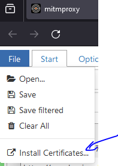
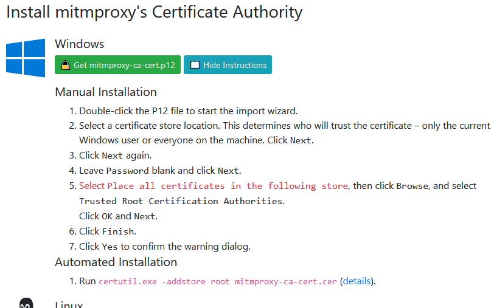
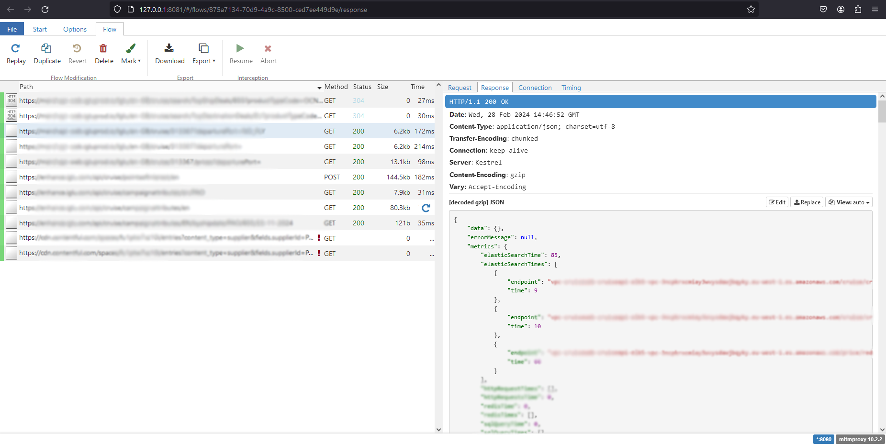
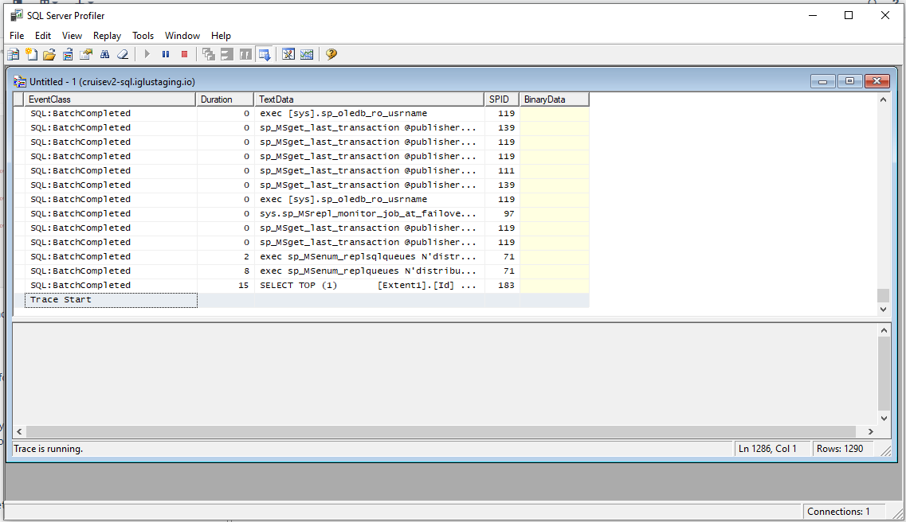
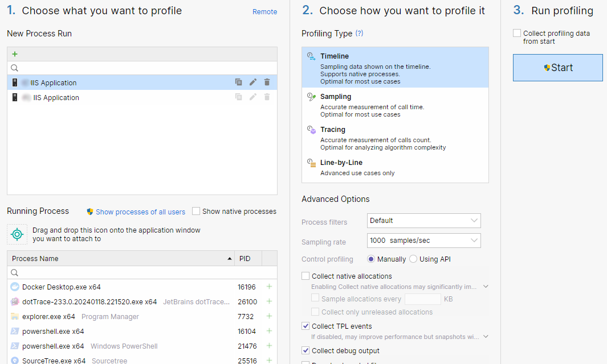
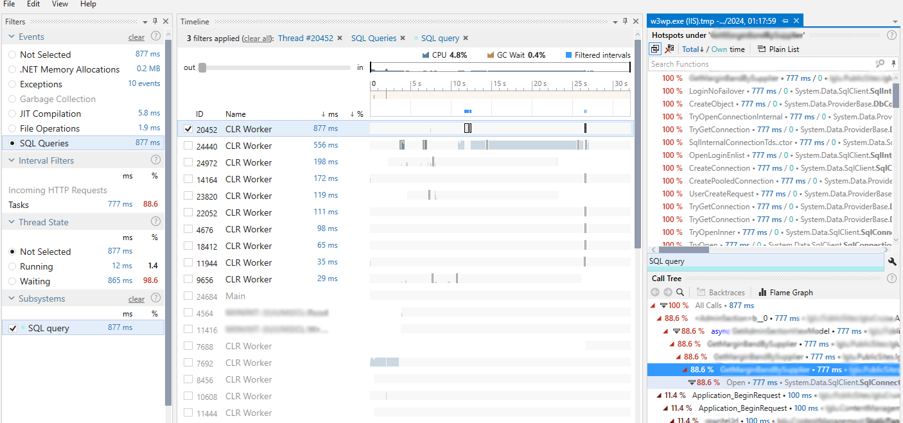

Profiling HTTP and SQL calls
============================

Summary
=======

This is a guide based on my research on how to profile HTTP or SQL calls coming from .NET applications in local development environment.

The coverage is not exhaustive, but I've spent a lot of time researching and testing, so you do not need to. 😄

I'm not covering Staging or Production environments, for that, it might be better to use other profiling/telemetry tools.

Motivation
==========

I needed recently a quick way how to profile a website application to see what HTTP calls are sent to our APIs.

Also, I needed to check SQL queries but I was more focused on the HTTP profiling. You can find the SQL part down under the HTTP profiling section.

HTTP profiling
==============

Generally, you need to be able to set your application to use HTTP proxy and use debug proxy to see the HTTP traffic.

This is not a problem for ASP.NET applications based on .NET Framework or new .NET Core which I'm focusing on in this guide.

App configuration
-----------------

### .NET Framework

For .NET Framework application, you just need to set default proxy configuration which you can setup in web.config like this:

```xml
<system.net>
  <defaultProxy>
    <proxy usesystemdefault="True" proxyaddress="http://localhost:8080" bypassonlocal="False" />
  </defaultProxy>
</system.net>
```
This will work in IIS Express and also in full IIS.

### ASP.NET Core

For running your app only from Visual Studio (IIS Express) you need to add environmental variables to your launchSettings.json like this:

```json
"profiles": {
  "http": {
    "commandName": "Project",
    "dotnetRunMessages": true,
    "launchBrowser": true,
    "applicationUrl": "http://localhost:5165",
    "environmentVariables": {
      "ASPNETCORE_ENVIRONMENT": "Development",
      "http_proxy": "http://localhost:8080",
      "https_proxy": "https://localhost:8080"
    }
  },
  "https": {
    "commandName": "Project",
    "dotnetRunMessages": true,
    "launchBrowser": true,
    "applicationUrl": "https://localhost:7075;http://localhost:5165",
    "environmentVariables": {
      "ASPNETCORE_ENVIRONMENT": "Development",
      "http_proxy": "http://localhost:8080",
      "https_proxy": "https://localhost:8080"
    }
  },
  "IIS Express": {
    "commandName": "IISExpress",
    "launchBrowser": true,
    "environmentVariables": {
      "ASPNETCORE_ENVIRONMENT": "Development",
      "http_proxy": "http://localhost:8080",
      "https_proxy": "https://localhost:8080"
    }
  }
}
```

I was testing it on full IIS as well and adding environment variables into web.config worked as well:

```xml
<configuration>
  <location path="." inheritInChildApplications="false">
    <system.webServer>
      <handlers>
        <add name="aspNetCore" path="*" verb="*" modules="AspNetCoreModuleV2" resourceType="Unspecified" />
      </handlers>
      <aspNetCore processPath="bin\Debug\net8.0\AspNetCoreWebAppMvc.exe" arguments="" stdoutLogEnabled="false" hostingModel="InProcess">
        <environmentVariables>
          <environmentVariable name="ASPNETCORE_HTTPS_PORT" value="85" />
          <environmentVariable name="ASPNETCORE_ENVIRONMENT" value="Development" />
          <environmentVariable name="http_proxy" value="http://localhost:8080"/>
          <environmentVariable name="https_proxy" value="https://localhost:8080"/>
        </environmentVariables>
      </aspNetCore>
    </system.webServer>
  </location>
</configuration>
```

Funnily, I spent probably a week scratching my head on how to setup .NET Core on full IIS, configuration of reverse proxy in IIS, middleware options just because I was trying to setup environment variables in the appsettings.json. ⚡

OK we covered how to setup your application, now let's jump to the debug proxies.

Debug proxies
-------------

If you need to proxy HTTPS you have to install the SSL Certificate of the debug proxy. I was using mostly the MITMPROXY so the guide for how to install the certificate is in the links list. It's pretty easy, you just need temporally add the proxy into your browser and install the cert from the page provided by the proxy. 



Note:\
if you are using full IIS you probably need to install the certificate to the machine store, current user store didn't work for me.

For IIS Express it might be enough to install it for current user. 



**MITMPROXY**. 

IMO best of what I've used. It's open-source and it's providing information which other tools provide only if you pay. Also you can choose from either console app or web app client.



It provides more functionality and also supports mocking using python script. But that's beyond what I needed. Probably best of easy to use tools.

**HTTP Toolkit**

Another one I tested and liked but I was disappointed that if you want to see additional information like call time you need to pay for the PRO version.  

**Fiddler**

Many know this one, formerly from Red Gate now Telerik. Fully featured Fiddler is payed but you can still use **Fiddler Classic** which provides basic information about HTTP calls. I've tested it once and it provided relatively detailed information but not as much as MITMPROXY.

If you need more you need to pay again. And also you need to give them your email even for the Classic version. 

**Wireshark**

Another tool which some know. It's far away from being easy tool. It's powerful network analyzer but it takes time to understand and know how to filter and read information from it.

SQL profiling
=============

For SQL profiling I've found three options.

**Visual Studio Database Tool**

Hit Alt+F2 to open profiler settings and check the database option. This one is the easier way, unfortunately, it's not available for projects based on .NET Framework.

See the guild in the links list.

**SQL Server Profiler**

One option is to use  which is part of the MSSM toolkit. Big disadvantage is that if you are profiling shared server, you will see also other applications traffic.



**JetBrains dotTrace**

Another way how to see only the activity of the application. Most of us are using JetBrains Resharper already and you should have access to the dotTrace as well along with dotMemory and dotPeek.

When you profile your application with dotTrace it can capture SQL queries. 

You have to choose **Timeline** profiling.



In the profiling snapshot you should see the section where you can filter and analyze SQL calls.



* * * * *

Thanks for reading and I hope it will be helpful to someone some day 👋
